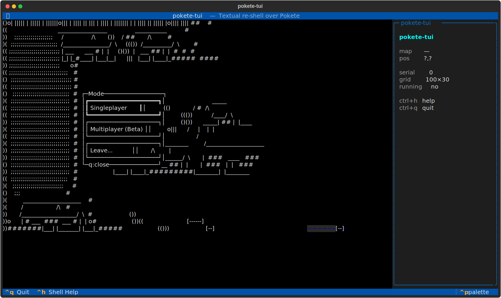
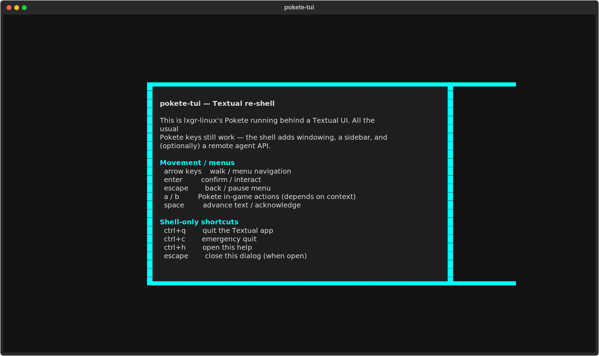
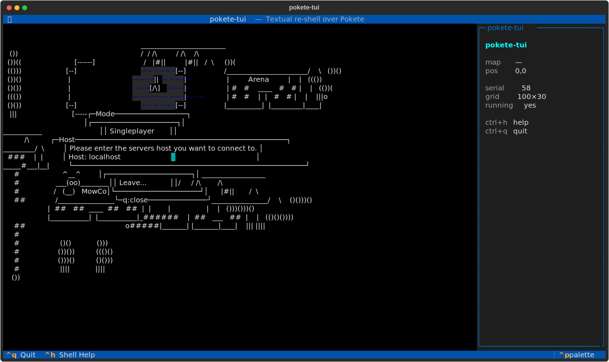

# pokete-tui
Gotta collect 'em all.





## About
Catch a Pokete. Raise a Pokete. Battle another trainer's Pokete. lxgr-linux's beloved terminal monster-collector, re-shelled in modern Textual with a multi-pane layout, mouse support, and a REST agent API. The trail winds through routes and rival trainers; the Pokedex fills one encounter at a time; the gym leaders loom. A pocket world in the shell.

## Screenshots


## Install & Run
```bash
git clone https://github.com/akakabrian/pokete-tui
cd pokete-tui
make
make run
```

## Controls
<Add controls info from code or existing README>

## Testing
```bash
make test       # QA harness
make playtest   # scripted critical-path run
make perf       # performance baseline
```

## License
GPL-3.0

## Built with
- [Textual](https://textual.textualize.io/) — the TUI framework
- [tui-game-build](https://github.com/akakabrian/tui-foundry) — shared build process
